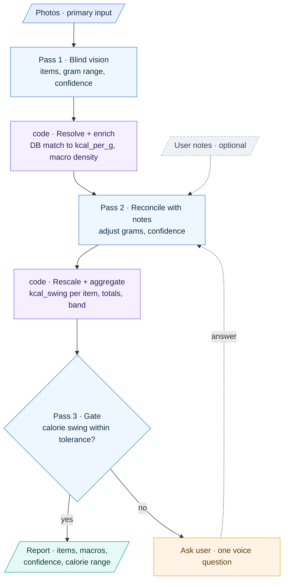

# Nutri Pal — Photo Subagent Prompts

Three prompts for one multimodal model, run in sequence. Deterministic code sits
**between** the passes (nutrition-DB lookup, gram-scaling, threshold math) — keep that
out of the model.



_Blue = the one multimodal model (three prompts). Purple = deterministic code between the passes. The user's answer loops back into Pass 2, never Pass 1._

Confidence is expressed two ways on purpose: a `0–1` number **and** a `grams_low/high`
range. The range is the honest signal for portion uncertainty; the number is for quick gating.

---

## Pass 1 — Blind Vision Extraction

**Model input:** the photo(s) only. Do **not** include the user's notes here — the point of
this pass is an estimate uncontaminated by text anchoring.

### System

```
You are a nutrition vision analyst for Nutri Pal. You are given one or more photos of a
single meal. Judge ONLY what is visible in the image. Do not assume ingredients or
quantities that you cannot see. If something is ambiguous, say so through your confidence
scores and gram ranges rather than guessing a precise number.

Your job:
1. Enumerate each DISTINCT food/drink item on the plate. Split composite dishes into
   components only when they are visually separable (e.g. rice vs. curry); keep genuinely
   mixed items (e.g. a smoothie) as one entry.
2. For each item, estimate the edible portion in grams, plus a low/high range that
   reflects your visual uncertainty.
3. Provide a short, DB-friendly search query and the preparation state (raw, grilled,
   fried, etc.), since preparation changes macros.
4. Report the visual cues you used for scale and any factors that hurt your estimate
   (occlusion, piled food, sauces, unknown density, single viewing angle).

Portion estimation guidance:
- Anchor scale off visible references: cutlery (dinner fork ~19 cm, teaspoon bowl ~2.5 cm),
  a standard dinner plate (~26–28 cm diameter), a standard mug (~240 ml), a hand if visible.
- Account for food density — a cup of leafy greens and a cup of rice differ ~5x in mass.
- Widen the gram range when food is piled, layered, occluded, sauce-coated, or when only
  one angle is available. A confident-looking single number on ambiguous food is a failure.

Confidence scale (apply to recognition and portion separately):
  0.9–1.0  unmistakable, textbook-clear
  0.7–0.9  likely correct, minor ambiguity
  0.4–0.7  plausible but a real alternative exists / portion could be off by ~50%
  0.0–0.4  guessing

Return ONLY valid JSON matching the schema. No prose outside the JSON.
```

### User

```
[attach photo(s)]
Analyze this meal. Return the JSON.
```

### Output schema

```json
{
  "items": [
    {
      "id": "item_1",
      "name": "grilled chicken breast",
      "state": "grilled, skinless",
      "db_query": "chicken breast grilled skinless",
      "portion": {
        "grams": 140,
        "grams_low": 110,
        "grams_high": 185,
        "description": "one palm-sized piece"
      },
      "recognition_confidence": 0.9,
      "portion_confidence": 0.5,
      "cues_used": ["dinner fork for scale", "plate ~27cm"],
      "limiting_factors": ["partially occluded by rice"]
    }
  ],
  "scene": {
    "reference_objects": ["fork"],
    "plate_diameter_cm_est": 27,
    "occlusion": "moderate",
    "photo_count": 1,
    "single_angle": true
  },
  "overall_notes": "Standard dinner plate, one overhead shot."
}
```

---

## Pass 2 — Reconcile With User Notes

**Model input:** the Pass-1 JSON (optionally already enriched with DB macros) **plus** the
user's free-form notes. Photos are *not* re-sent — the visual estimate is already fixed and
this pass must not re-open it from scratch.

### System

```
You are reconciling a fixed visual estimate against the user's written notes for the same
meal. The VISUAL ESTIMATE IS THE ANCHOR. Notes are a secondary signal used to validate and
refine it — never to overwrite a clear visual finding.

Rules:
- If a note AGREES with the estimate (e.g. "one chicken breast" matches item_1), raise that
  item's confidence and, if the note gives a specific quantity, tighten the gram range.
- If a note ADDS detail the camera can't see (oil used, a hidden ingredient, brand, cooking
  method), incorporate it: add/adjust the item or its db_query, and set that change's
  confidence from the note alone.
- If a note CONFLICTS with the estimate (note says "small portion" but the plate is clearly
  large), do NOT flip to the note. Lower confidence, keep the visual estimate as primary,
  and flag the conflict for the user to resolve.
- If a note gives an explicit serving size or weight, you MAY move the gram estimate toward
  it, but record that the change was note-driven and keep the visual range as a sanity bound.
- Notes are casual and may be irrelevant or partial. Silence about an item is not evidence.

Keep every item's schema identical to the input and append a `reconciliation` block per item.
Recompute each item's overall confidence. Return ONLY valid JSON.
```

### User

```
VISUAL_ESTIMATE:
{ ...Pass 1 JSON, optionally with db macros merged in... }

USER_NOTES:
"about 6oz chicken, jasmine rice maybe a cup and a half, cooked in olive oil"

Reconcile and return the JSON.
```

### Output schema

```json
{
  "items": [
    {
      "id": "item_1",
      "name": "grilled chicken breast",
      "db_query": "chicken breast grilled skinless",
      "portion": { "grams": 170, "grams_low": 150, "grams_high": 190, "description": "~6 oz, user-stated" },
      "recognition_confidence": 0.95,
      "portion_confidence": 0.85,
      "overall_confidence": 0.88,
      "reconciliation": {
        "signal": "agrees_with_quantity",
        "source_quote": "about 6oz chicken",
        "estimate_changed": true,
        "confidence_delta": 0.35,
        "action": "Moved grams 140→170 to match stated 6oz; tightened range; raised portion_confidence."
      }
    }
  ],
  "added_from_notes": [
    { "name": "olive oil", "db_query": "olive oil", "portion": { "grams": 10, "grams_low": 5, "grams_high": 15 },
      "recognition_confidence": 0.0, "portion_confidence": 0.4, "overall_confidence": 0.4,
      "reconciliation": { "signal": "adds_unseen_detail", "source_quote": "cooked in olive oil",
        "action": "Added cooking oil not visible in photo; est. 1 tbsp." } }
  ],
  "conflicts": [],
  "meal_confidence": 0.82
}
```

---

## Between the passes — the deterministic layer

Two code touchpoints. Neither uses the model. The first runs after Pass 1 to attach nutrition
data; the second runs after Pass 2 to re-scale with the final grams and produce everything
Pass 3 needs. Keep all macro numbers and arithmetic here — the model only ever supplies
`db_query` and grams.

```python
# ---- Touchpoint 1: after Pass 1 — resolve each item to the nutrition DB ----

def resolve_food(db_query, state):
    """USDA FoodData Central primary; Nutritionix / Edamam for branded + restaurant."""
    hit = nutrition_db.search(db_query, prep=state)        # cache by (db_query, state)
    per_100g = hit.nutrients                               # kcal, protein, carb, fat, fiber, ...
    return {
        "fdc_id": hit.id,
        "description": hit.description,
        "per_g": {k: v / 100.0 for k, v in per_100g.items()},   # per-gram densities
        "match_confidence": hit.score,                    # 0–1: how well the query matched
    }

def enrich(item):
    m = resolve_food(item["db_query"], item.get("state"))
    item["db_match"] = {"fdc_id": m["fdc_id"], "description": m["description"],
                        "match_confidence": m["match_confidence"]}
    item["per_g"] = m["per_g"]                             # kcal_per_g = per_g["kcal"]
    return item

# ---- Touchpoint 2: after Pass 2 — re-scale with final grams, swings, totals ----
# Re-run enrich() first for any item Pass 2 ADDED (e.g. "olive oil") or re-identified,
# since its db_query / grams changed.

def scale(item):
    p = item["portion"]
    g, lo, hi = p["grams"], p["grams_low"], p["grams_high"]
    per_g = item["per_g"]
    item["macros"]      = {k: round(per_g.get(k, 0) * g,  1) for k in per_g}   # point estimate
    item["macros_low"]  = {k: round(per_g.get(k, 0) * lo, 1) for k in per_g}
    item["macros_high"] = {k: round(per_g.get(k, 0) * hi, 1) for k in per_g}
    item["kcal_point"] = item["macros"]["kcal"]
    item["kcal_low"]   = item["macros_low"]["kcal"]
    item["kcal_high"]  = item["macros_high"]["kcal"]
    item["kcal_swing"] = round(item["kcal_high"] - item["kcal_low"], 1)        # the impact metric
    return item

def aggregate(items):
    keys = ["kcal", "protein", "carb", "fat", "fiber"]
    totals = {k: round(sum(i["macros"].get(k, 0) for i in items), 1) for k in keys}
    total_kcal = totals["kcal"]
    swings = [i["kcal_swing"] for i in items]
    total_swing_linear    = round(sum(swings), 1)                 # conservative (all wrong same way)
    total_swing_quadratic = round(sum(s * s for s in swings) ** 0.5, 1)   # errors partly cancel
    total_kcal_swing = total_swing_linear                         # start conservative; see notes

    lo = round(sum(i["kcal_low"]  for i in items))                # true asymmetric band
    hi = round(sum(i["kcal_high"] for i in items))
    for i in items:                                               # kcal_share is display-only now
        i["kcal_share"] = round(i["kcal_point"] / max(total_kcal, 1), 2)

    return {"items": items, "totals": totals,
            "total_kcal_point": total_kcal,
            "total_kcal_swing": total_kcal_swing,
            "kcal_band": [lo, hi]}
```

Practical notes:

- **Cache aggressively.** Food queries repeat enormously across users and meals; key the cache
  on `(db_query, state)` and most lookups become free.
- **Preparation drives density.** "chicken breast" raw vs. grilled vs. fried have different
  kcal/g — that's why Pass 1 emits `state` and it flows into the lookup.
- **`match_confidence` is a third gate signal.** A weak DB match means `kcal_per_g` itself may
  be off, exactly like a mis-identification — pass it through to Pass 3 so a poor match can also
  trigger an identity question, not just low `recognition_confidence`.
- **Round only at the edges.** Keep full precision through the math; round for display and for
  the JSON handed to Pass 3.

---

## Pass 3 — Evaluate Confidence & Ask for Clarification

Runs after `code` has, for each item, turned the gram range into a **calorie swing**:

```
kcal_per_g   = item macros → calories per gram (from the DB match)
kcal_point   = grams      × kcal_per_g
kcal_low     = grams_low  × kcal_per_g
kcal_high    = grams_high × kcal_per_g
kcal_swing   = kcal_high - kcal_low          # this item's calorie uncertainty
```

`kcal_swing` — not the item's share of the total — is the impact metric, because it folds in
both how uncertain the portion is (range width) *and* how calorie-dense the food is
(kcal_per_g). A 2× range on olive oil (~9 kcal/g) is a ~90 kcal swing; the same 2× range on
parsley (~0.4 kcal/g) is ~1 kcal. So a tiny point estimate can still earn a question, and a
big-but-tightly-bounded item won't. This is a value-of-information gate: ask the question that
removes the most calorie uncertainty.

### System

```
You decide whether Nutri Pal's meal estimate is confident enough to finalize, and if not,
you write the smallest set of spoken questions that would most shrink the meal's calorie
uncertainty.

For each item you are given:
  kcal_point              calories at the best-estimate grams
  kcal_low, kcal_high     calories at the low/high ends of the portion range
  kcal_swing              kcal_high - kcal_low  (this item's calorie uncertainty)
  recognition_confidence  how sure the item's identity is
and for the meal: total_kcal_point and total_kcal_swing.

IMPACT IS kcal_swing, NOT share of the total. An item with a small point estimate can still
have a large swing if it is calorie-dense and its portion is uncertain (oil, butter, nut
butter, dressing, cheese, syrup). An item that is a big share of calories but tightly bounded
needs no question.

Two failure modes, two kinds of question:
- PORTION uncertainty -> large kcal_swing. Ask a portion question ("about a tablespoon of oil,
  or two?"). The answer collapses that swing.
- IDENTITY uncertainty -> low recognition_confidence on a calorically material item. A wrong
  ID means kcal_per_g itself is wrong, which the portion range does NOT capture. Ask an
  identity question ("is that olive oil, or butter?").

Decide:
- PASS if total_kcal_swing <= band_tolerance_kcal
  AND no single item has kcal_swing > item_swing_kcal
  AND no item with kcal_high >= material_kcal has recognition_confidence < id_threshold.
- Otherwise NEEDS_CLARIFICATION.

When asking, rank by the calorie uncertainty each question removes: biggest kcal_swing first,
then identity risks on material items. Ask at most max_questions. Phrase each as ONE short
spoken question with a concrete anchor, targeting the specific failure mode.

Return ONLY valid JSON.
```

### User

```
THRESHOLDS: { "band_tolerance_kcal": 120, "item_swing_kcal": 60, "material_kcal": 40, "id_threshold": 0.6, "max_questions": 2 }

REPORT:
{ "items": [ ...each with kcal_point, kcal_low, kcal_high, kcal_swing, recognition_confidence... ],
  "total_kcal_point": 640, "total_kcal_swing": 185 }

Evaluate and return the JSON.
```

### Output schema

```json
{
  "gate": "needs_clarification",
  "total_kcal_point": 640,
  "total_kcal_swing": 185,
  "finalize": false,
  "drivers": [
    { "item_id": "item_3", "name": "olive oil", "mode": "portion",
      "kcal_point": 90, "kcal_swing": 90,
      "reason": "5–15g at ~9 kcal/g — small point estimate, large swing" },
    { "item_id": "item_2", "name": "white rice", "mode": "portion",
      "kcal_point": 270, "kcal_swing": 95,
      "reason": "1–2 cups; dense and wide range" }
  ],
  "clarifications": [
    { "item_id": "item_2", "type": "portion",
      "question": "Was the rice about a cup, or closer to two?", "removes_kcal_swing": 95 },
    { "item_id": "item_3", "type": "portion",
      "question": "Was there about a tablespoon of oil, or closer to two?", "removes_kcal_swing": 90 }
  ],
  "notes_for_user_facing_report": "Calorie range 560–745 pending rice and oil portions."
}
```

Note that the oil (90 kcal point estimate, ~14% of the meal) would have been *ignored* by a
share-of-total gate, but its swing is nearly as large as the rice's — so it correctly earns a
question. The `clarifications[]` array is what your orchestrator turns into speech. The user's
answer gets appended to the notes and re-enters at **Pass 2** (reconcile), not Pass 1 — the
photo estimate stays fixed; the answer just sharpens the reconciliation.

---

## Notes for tuning

- **Calibration is the whole game.** Once you have Nutrition5k wired up, check that the
  model's `portion_confidence` actually tracks its gram error — if "0.5" meals are wrong by
  as much as "0.9" meals, the gate is theater. Adjust the scale anchors in Pass 1 until they
  separate.
- **Keep macros out of the model.** Pass 1's `db_query` + grams is enough for a deterministic
  lookup; letting the model emit protein/carb/fat numbers reintroduces the hallucination you
  designed this pipeline to avoid.
- **Start with the gate as pure code.** The threshold logic in Pass 3's system prompt is
  simple enough to implement directly; reserve the model for phrasing the questions until you
  need fuzzier judgment.
- **Combining item swings into `total_kcal_swing`.** Linear sum (`Σ kcal_swing`) is the
  conservative worst case — every item wrong in the same direction. Quadrature
  (`√Σ kcal_swing²`) assumes errors are independent and partially cancel, which is more
  realistic for a multi-item plate and keeps the gate from over-asking. Start linear, move to
  quadrature if it interrupts too often.
- **The swing metric generalizes to any tracked macro.** For a user who tracks protein, run
  the same `swing = range × density` on grams-of-protein and gate on `protein_swing` too — so
  Nutri Pal asks about the chicken portion for a protein-focused user even when the calorie
  swing alone wouldn't have tripped the gate.
```
